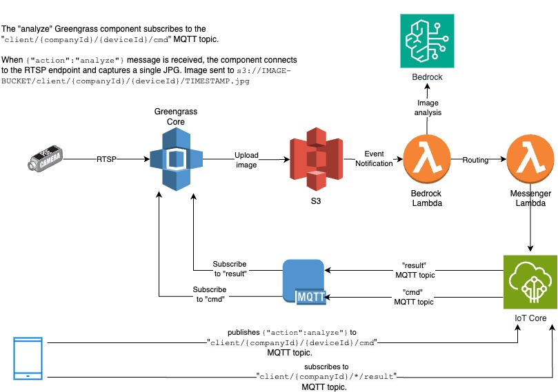

# IoT Content Narrative

# tl;dr

Install instructions are found [here](src/)

# Safety Monitoring with Amazon Bedrock and AWS Greengrass

In today's industrial environments, the ability to detect and respond to safety concerns in real-time is a critical business imperative. By combining the power of edge computing with advanced AI capabilities, organizations can transform their safety monitoring from a reactive process to a proactive system that identifies and alerts to potential hazards as they develop.

This solution demonstrates how to seamlessly integrate AWS IoT Greengrass devices with Amazon Bedrock's powerful language models to create an intelligent image analysis system. Using standard RTSP camera feeds, the system can continuously monitor workspaces, automatically assess safety conditions, and provide immediate alerts based on OSHA compliance standards.

What makes this architecture particularly powerful is its simplicity and scalability. By leveraging AWS Greengrass components, the solution can be deployed across thousands of edge devices while maintaining consistent performance and security. Each device operates independently, capturing images from local RTSP streams and utilizing Amazon Bedrock's Claude 3 models for sophisticated image analysis—all while requiring minimal bandwidth for the actual AI processing.

Key benefits of this architecture include:

* Real-time safety monitoring with immediate visual alerts
* Scalable deployment across multiple facilities and devices
* Automated OSHA compliance checking
* Secure edge-to-cloud communication
* Flexible priority-based alerting system



## **Technical Architecture**

The solution's architecture combines edge computing capabilities with cloud-based AI services, creating a robust and secure analysis pipeline. Here's a brief description of the core components for this design:

**AWS IoT Greengrass Core** serves as the intelligent edge runtime, deployed on devices such as Raspberry Pi with SenseHat displays. Each Greengrass core operates autonomously, managing its local RTSP video stream and capturing images based on MQTT triggers. Device-specific configurations are maintained through IoT thing attributes, allowing for flexible deployment across different locations and use cases. This edge-first approach minimizes bandwidth usage while maintaining consistent analysis capabilities, regardless of network conditions.

**S3** is used to take an image from a device to be stored with a structured prefix that includes company and device identifiers, creating a systematic and searchable repository of safety-related imagery. The S3 bucket acts as both a storage solution and a trigger mechanism for the Bedrock Lambda, which initiates the AI-powered safety analysis.

The **Lambda Function Chain** creates a processing pipeline that separates concerns for maximum reliability. The Bedrock Lambda function specializes in image analysis, handling the interaction with Amazon Bedrock's AI models and ensuring consistent prompt engineering across all requests. The Messenger Lambda function takes ownership of result distribution, managing MQTT publications and ensuring that analysis results reach the correct devices. This separation allows each function to scale independently and simplifies error handling and monitoring.

**Amazon Bedrock Integration** delivers sophisticated image analysis through Claude 3 models, transforming raw images into actionable safety insights. Each analysis provides a structured response that includes priority levels, detailed summaries, and specific OSHA compliance references. This standardized output allows downstream systems to automate responses based on severity levels, while maintaining clear audit trails for compliance purposes. The integration is designed to be consistent across all devices, ensuring that safety standards are uniformly applied regardless of location or deployment size.


## Security and Communication Flow

The solution implements a robust security model that ensures end-to-end protection of data while maintaining operational efficiency. At its core, the communication flow follows a carefully orchestrated sequence that balances security with real-time performance needs.


### Authentication and Authorization

When a Greengrass device it is tagged with unique key-value attributes to uniquely identify a company where this is deployed and the unique device identifier. These identifiers are securely stored as thing attributes in AWS IoT Core, creating a trusted identity that persists throughout the device's lifecycle. Rather than relying on static credentials, the device requests temporary security tokens through the Token Exchange Service, TES. This dynamic credential approach significantly reduces security risks and aligns with AWS best practices for IoT deployments.


### Scalability and Isolation

The security architecture is designed for multi-tenant deployments, with clear isolation between different clients and their respective devices. Each device operates within its own security boundary, defined by:

* Unique MQTT topics scoped to specific client and device IDs
* Device-specific S3 prefixes for security and scalability
* Isolated result channels

This isolation ensures that even in large deployments with thousands of devices, each unit maintains its security context while sharing the common analysis infrastructure. The system's region-specific deployment model further enhances security by keeping data within designated geographical boundaries, helping organizations meet various compliance requirements.


## Implementation Flow

The implementation flow demonstrates how the system processes safety analyses from initial capture to final visualization. We will walk through each stage of this process, highlighting the practical implementation details that make this solution robust and maintainable.


### Image Capture and Analysis Trigger

The process begins when a Greengrass device receives an analysis request through its MQTT topic. The device component, implemented in Python, maintains a continuous subscription to its dedicated analysis topic:


```
analyze_topic = f"client/{companyId}/{deviceId}/analyze"
```


When triggered, the device captures an image from its configured RTSP stream. The RTSP configuration is maintained in the device's thing attributes, allowing for flexible deployment across different camera setups. The system includes built-in resilience with configurable retry logic and timeouts, ensuring reliable operation even in challenging network conditions.


### Bedrock Analysis Process

Once captured, the image is processed through Amazon Bedrock using Claude 3, with a carefully crafted prompt that ensures consistent and relevant safety analysis. The prompt engineering focuses on four key elements:

* Priority ranking (1-5 scale)
* Scene summary
* Detailed safety description
* Relevant OSHA standard references

For example, a typical analysis might return:

```
{
  "analysis": {
    "priority": 2,
    "summary": "The image shows a work area with ...",
    "description": "The bookshelf appears to be ...",
    "oshaReference": "OSHA Standard ...."
  },
  "token_usage": {
    "input_tokens": 1807,
    "output_tokens": 181,
    "total_tokens": 1988
  },
  "requester": {
    "companyId": "client-3985",
    "deviceId": "device-001",
    "timestamp": "2025-03-25T17:51:10+00:00"
  }
}
```

### Result Handling and Visualization

**Note that the Sense Hat LED notification is not working at this time due to an RTIMU bug. See [here](src/README.md#result-component-with-sense-hat-integration) for further details**

The analysis results trigger a visual response on the device's SenseHat LED matrix, using a color-coded system that immediately communicates priority levels:

* Red: Critical safety concerns (Priority 5)
* Red Orange: Significant issues (Priority 4)
* Orange: Moderate concerns (Priority 3)
* Yellow: Minor issues (Priority 2)
* Green: Informational (Priority 1)

This visual feedback system provides immediate situational awareness without requiring operator interaction. All analyses are also logged locally on the device and in CloudWatch for audit and trend analysis purposes.


### Error Handling and Resilience

The implementation includes comprehensive error handling at each stage:

* RTSP capture failures are logged with specific error codes
* Network connectivity issues trigger automatic retries
* Analysis timeouts are managed with configurable thresholds
* Component errors are logged with detailed diagnostics

Each error condition includes appropriate fallback behaviors and logging, ensuring that system administrators can quickly identify and resolve issues while maintaining operational continuity.


## Conclusion

The integration of AWS IoT Greengrass with Amazon Bedrock represents more than just a technical achievement—it demonstrates how modern cloud services can solve real-world safety challenges at scale. By bringing sophisticated AI capabilities to the edge, organizations can transform their safety monitoring from periodic inspections to continuous, intelligent observation.


### Business Impact

This solution delivers immediate value across several dimensions:

* **Reduced Risk**: Continuous monitoring catches safety issues before they become incidents
* **Compliance Automation**: OSHA standard verification becomes a real-time, automated process
* **Operational Efficiency**: Visual alerts enable quick response without constant manual monitoring
* **Scalable Deployment**: From single facilities to enterprise-wide implementation with consistent results

### Technical Innovation

The architecture demonstrates several key innovations in edge AI deployment:

* Efficient use of edge computing to minimize bandwidth requirements
* Secure, token-based authentication for large-scale device deployment
* Standardized analysis through careful prompt engineering
* Visual feedback system that requires no technical expertise to interpret

### Future Possibilities

This implementation provides a foundation for further enhancements:

* Integration with additional sensor types for comprehensive environmental monitoring
* Machine learning models for pattern recognition across multiple locations
* Automated incident reporting and compliance documentation
* Integration with emergency response systems

By combining the power of edge computing with advanced AI capabilities, this solution shows how organizations can create safer workplaces while maintaining operational efficiency. The architecture's scalability and security features ensure that it can grow with organizational needs, while its standardized approach to analysis ensures consistent safety standards across all locations.

The future of workplace safety lies in these intelligent, automated systems that never stop watching, never tire, and never miss a potential hazard. This solution represents a significant step toward that future, making advanced AI capabilities accessible and practical for real-world safety applications.


* * *


